# Image Transform Engine

    

> A pixel-level image processing engine built from scratch in Java — no third-party image libraries, just pure matrix math, kernel convolution, and a scriptable command interface.

Image Transform Engine reads images into raw 3D pixel matrices and applies transformations directly at the pixel level across PNG, JPG, and PPM formats. Every filter — blur, sharpen, sepia, grayscale — is implemented from scratch. Operations can be chained interactively or scripted for batch processing.

------------------------------------------------------------------------

## Gallery

Every output below was produced entirely by Image-Transform-Engine.

**Mountain (PNG)**

| Original | Brighter (+50) | Darker (-50) | Sepia | Blur | Sharpen |
|----|----|----|----|----|----|
| 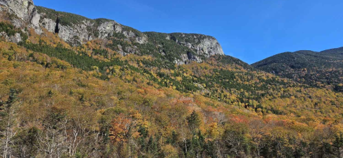 | 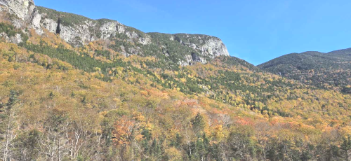 | 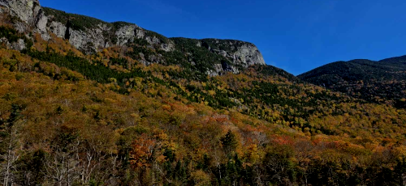 | 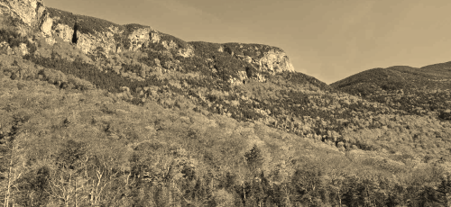 |  | 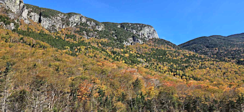 |

**RGB Channel Decomposition**

| Red Channel | Green Channel | Blue Channel | Recombined |
|----|----|----|----|
| 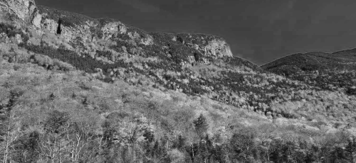 | 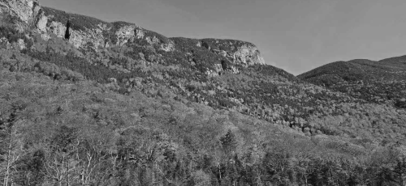 | 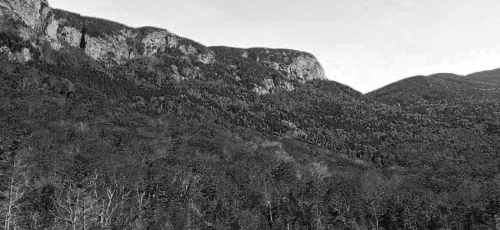 |  |

**Grayscale Methods**

| Luma | Intensity | Value |
|----|----|----|
|  | 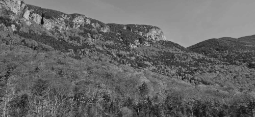 | 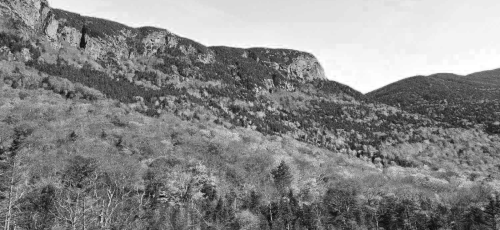 |

**Geometric Transforms**

| Horizontal Flip | Vertical Flip | Both |
|----|----|----|
| 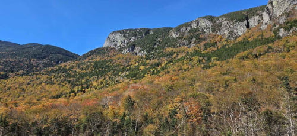 | 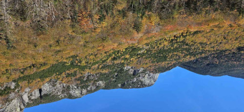 | 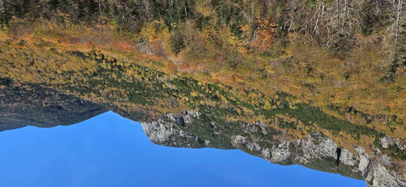 |

------------------------------------------------------------------------

## What It Can Do

12 operations, all chainable in a script:

| Command | Description |
|----|----|
| `load <path> <name>` | Load a PNG, JPG, or PPM image into memory |
| `brighten <int> <src> <dest>` | Adjust brightness up or down by any amount |
| `horizontal-flip <src> <dest>` | Mirror the image horizontally |
| `vertical-flip <src> <dest>` | Mirror the image vertically |
| `rgb-split <src> <red> <green> <blue>` | Decompose into individual R, G, B channel images |
| `rgb-combine <dest> <red> <green> <blue>` | Reconstruct a full-color image from three channels |
| `value-component <src> <dest>` | Grayscale via `max(R, G, B)` per pixel |
| `luma-component <src> <dest>` | Grayscale via `0.2126R + 0.7152G + 0.0722B` |
| `intensity-component <src> <dest>` | Grayscale via `(R + G + B) / 3` |
| `sepia <src> <dest>` | Apply classic warm sepia tone |
| `blur <src> <dest>` | Gaussian blur via kernel convolution |
| `sharpen <src> <dest>` | Edge enhancement via sharpening kernel |

------------------------------------------------------------------------

## Getting Started

### Prerequisites

- Java 8+
- No external dependencies

### Clone & Run

``` bash
git clone https://github.com/Yashb0299/Image-Transform-Engine
cd Image-Transform-Engine
javac src/*.java
java -cp src ImageProcessorScript
```

### Interactive Mode

``` bash
load res/SampleImages/Mountain.png mountain
brighten 50 mountain mountain-bright
sepia mountain-bright mountain-bright-sepia
horizontal-flip mountain-bright-sepia mountain-final
```

### Script Mode

Chain operations in a `.txt` file and pipe them in:

``` bash
java -cp src ImageProcessorScript < test/ScriptTest.txt
```

------------------------------------------------------------------------

## Example Workflows

**Basic pipeline — brighten, flip, filter:**

``` bash
load res/images/test-image.jpg test-image
brighten 20 test-image test-image-brighter
horizontal-flip test-image test-image-horizontal-flip
sepia test-image test-image-sepia
blur test-image test-image-blur
sharpen test-image test-image-sharpen
brighten -50 test-image test-image-darker
horizontal-flip test-image-darker test-image-darker-horizontal-flip
vertical-flip test-image-darker test-image-darker-vertical-flip
```

**RGB decomposition and creative recombination:**

``` bash
# Split city image into channels, process each independently, recombine
load res/images/city.jpg city-image
rgb-split city-image city-image-red city-image-green city-image-blue
sharpen city-image-red city-image-red-sharpened
sepia city-image-green city-image-green-sepia
vertical-flip city-image-blue city-image-blue-vertical-flip
rgb-combine city-image-recombined city-image-red-sharpened city-image-green-sepia city-image-blue-vertical-flip
```

**Landscape — grayscale into sepia pipeline:**

``` bash
load res/images/landscape.png landscape-image
intensity-component landscape-image landscape-intensity
sepia landscape-intensity landscape-intensity-sepia
horizontal-flip landscape-intensity-sepia landscape-sepia-horizontal-flip
rgb-split landscape-sepia-horizontal-flip landscape-red landscape-green landscape-blue
rgb-combine landscape-recombined landscape-red landscape-green landscape-blue
```

**PPM format — full pipeline:**

``` bash
load res/images/ppm-test-image.ppm ppm-test-image
brighten 20 ppm-test-image ppm-test-image-brighter
brighten -10 ppm-test-image ppm-test-image-darker
horizontal-flip ppm-test-image ppm-test-image-horizontal-flip
vertical-flip ppm-test-image ppm-test-image-vertical-flip
rgb-split ppm-test-image ppm-test-image-red ppm-test-image-green ppm-test-image-blue
rgb-combine ppm-test-image-recombined ppm-test-image-red ppm-test-image-green ppm-test-image-blue
value-component ppm-test-image ppm-test-image-value-greyscale
luma-component ppm-test-image ppm-test-image-luma-greyscale
```

------------------------------------------------------------------------

## Architecture

### UML Diagram

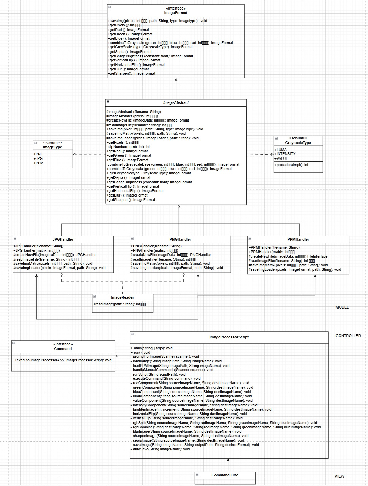

### MVC Overview

```         
Image-Transform-Engine/
├── src/
│   ├── ImageFormat.java           # Core interface — 12 operations defined here
│   ├── ImageAbstract.java         # Abstract class — shared pixel-level logic
│   ├── PNGHandler.java            # PNG-specific read/write
│   ├── JPGHandler.java            # JPG-specific read/write
│   ├── PPMHandler.java            # PPM (P3 ASCII) read/write
│   ├── ImageReader.java           # BufferedImage → 3D pixel matrix via bitwise ops
│   ├── ImageProcessorScript.java  # Command interpreter and controller
│   ├── Command.java               # Command interface
│   ├── ImageType.java             # Enum: PNG, JPG, PPM
│   └── GreyscaleType.java         # Enum: LUMA, INTENSITY, VALUE
├── res/
│   ├── PNG/                       # Mountain PNG outputs (16 variants)
│   ├── images/                    # City and landscape outputs (30+ files)
│   ├── PPM/                       # PPM format outputs (15 variants)
│   └── SampleImages/              # Input images (Mountain, Manhattan Skyline, UML)
└── test/
    ├── PNGHandlerTest.java        # PNG unit tests
    ├── PPMHandlerTest.java        # PPM unit tests
    └── ScriptTest.txt             # 40+ chained integration operations
```

**Model** — `ImageFormat` defines the interface. `ImageAbstract` implements all pixel-level logic — convolution, matrix math, channel splitting. Each format handler (`PNGHandler`, `JPGHandler`, `PPMHandler`) extends it with format-specific I/O only. No manipulation logic is ever duplicated.

**Controller** — `ImageProcessorScript` parses commands, dispatches them to the right handler, and maintains an in-memory image store keyed by name. The `Command` interface encapsulates each operation independently.

**View** — Pure command-line. Supports both interactive input and script-based batch execution via stdin.

------------------------------------------------------------------------

## Design Decisions

**No image processing libraries.** Every filter is implemented from scratch using kernel convolution and direct pixel matrix operations. `ImageReader` extracts raw RGB values from `BufferedImage` using bitwise operations — `(pixel & 0xFF0000) >> 16` for red, `(pixel & 0x00FF00) >> 8` for green, `(pixel & 0x0000FF)` for blue — and stores them in an `int[height][width][3]` matrix that all operations work on directly.

**Three distinct grayscale methods.** Luma (`0.2126R + 0.7152G + 0.0722B`) is perceptually accurate and matches how the human eye weights color. Intensity (`(R+G+B)/3`) is a simple average. Value (`max(R,G,B)`) preserves brightness. They produce visually different results and all three are worth having.

**PPM as a first-class format.** ASCII P3 PPM files store raw RGB values in plain text, making them ideal for debugging — any output file can be opened in a text editor to inspect exact pixel values. The parser strips comment lines and validates the `P3` header before reading.

**In-memory image store.** Processed images are stored by name in memory rather than written to disk between steps, enabling complex multi-step pipelines with zero intermediate I/O overhead.

**Pixel clamping.** All operations clamp output values to `[0, 255]` to prevent overflow/underflow artifacts — particularly important for brightness adjustment and kernel convolution where values can easily go out of range.

**`createNewFile` factory pattern.** `ImageAbstract` uses a protected abstract `createNewFile(int[][][] imageData)` method that each subclass implements to return the correct concrete type. All shared operations in the abstract class automatically return the right format without any casting.

------------------------------------------------------------------------

## Testing

JUnit test suite covering all 12 operations for PNG and PPM formats. Floating-point filter operations (blur, sharpen, sepia, grayscale) use a ±1 pixel margin to account for rounding:

``` bash
javac -cp src:lib/junit.jar test/PNGHandlerTest.java
java -cp src:lib/junit.jar:test org.junit.runner.JUnitCore PNGHandlerTest

javac -cp src:lib/junit.jar test/PPMHandlerTest.java
java -cp src:lib/junit.jar:test org.junit.runner.JUnitCore PPMHandlerTest
```

Integration testing via `ScriptTest.txt` runs 40+ chained operations across JPG, PNG, and PPM end-to-end.

------------------------------------------------------------------------

## License

MIT — free to use, modify, and build on.
